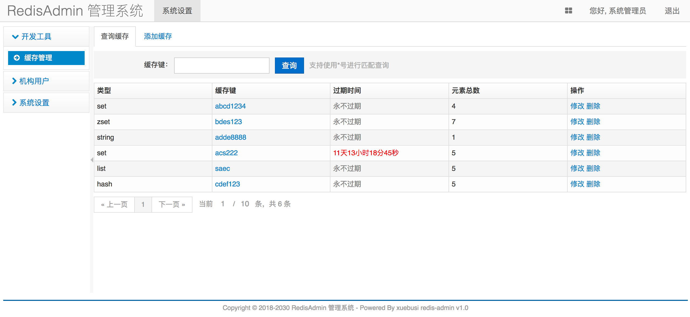
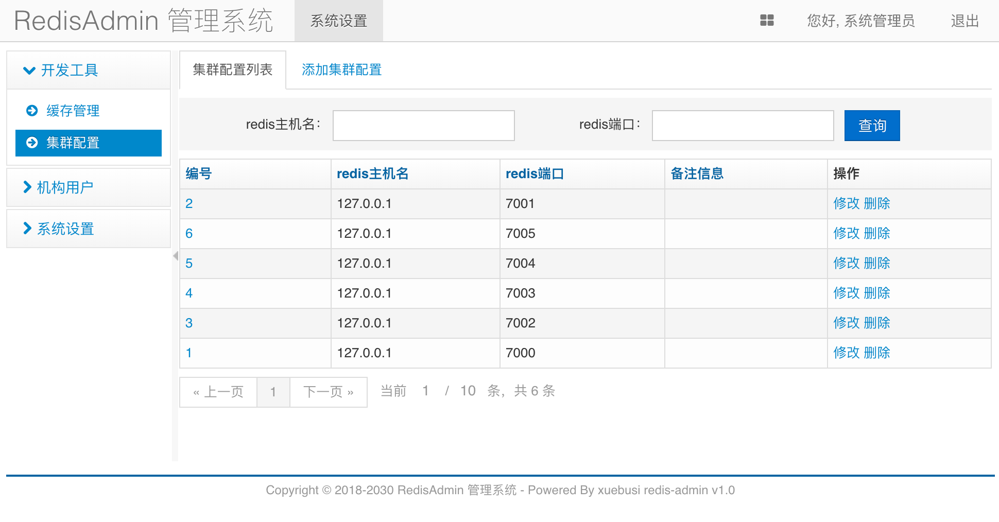
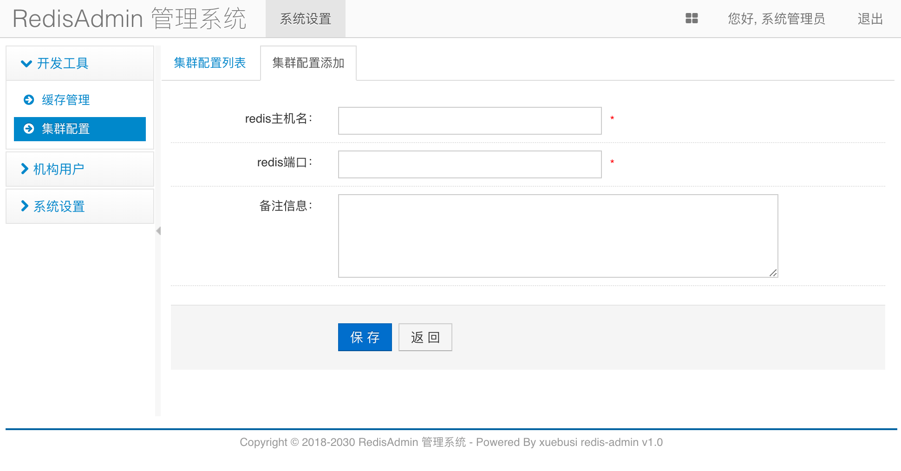

# redis-admin

#### 项目介绍
一个简单好用的redis缓存图形化管理工具，包含redis的5种数据类型的CRUD操作; 由于该系统是在大名鼎鼎的JeeSite基础之上开发的，所有保留了原系统的用户/角色/权限/菜单等模块.

#### 软件涉及技术
1. SpringBoot
2. SpringMVC
3. Mybatis
4. JSP
5. JQuery
6. Ehcache
7. MySQL
8. Redis

#### 安装教程

1. 创建名为x-redis-admin数据库
2. 在创建好的数据库中执行 sql/db.sql 脚本文件来初始化基础数据
3. 修改application-dev.yml中的数据库名称、用户名和密码, 以及修改redis配置
4. 运行App.java中的main方法启动系统
5. 默认浏览器访问地址 http://localhost:18080
6. 默认系统登陆账号 admin 密码 admin

#### 打包运行
1. 打包:执行命令 mvn clean package 对项目进行打包，打好的war包生成在项目的target目录下.

2. 生产中运行:打好war包之后，在linux下请执行该命令来启动项目: java -jar redis-admin-1.0.0-SNAPSHOT.war

#### 有图有真相

#### 项目计划

1. 实现redis主机和端口的图形化配置功能
2. 实现集合中元素的修改操作
3. 实现Reids集群配置管理功能
4. 实现Redis集群监控

#### 参与贡献

欢迎优秀的开发人员参与该项目, 贡献自己的代码, 一起做一个最好的Redis客户端工具!
联系QQ 490983587

